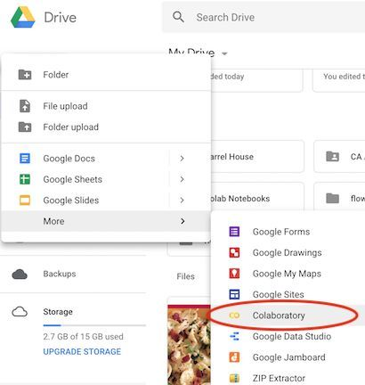
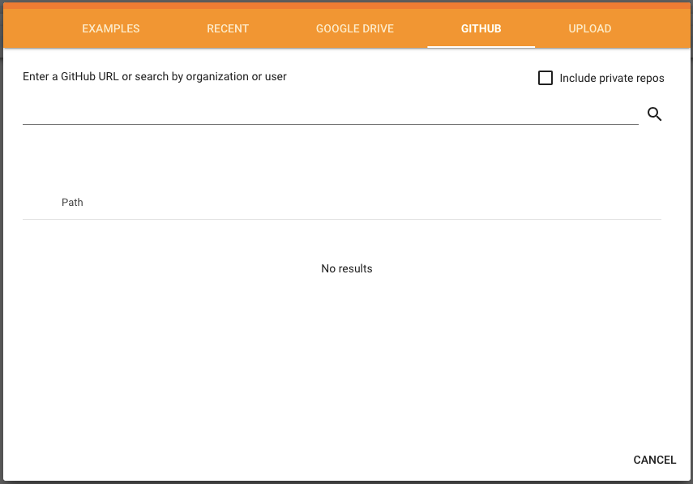
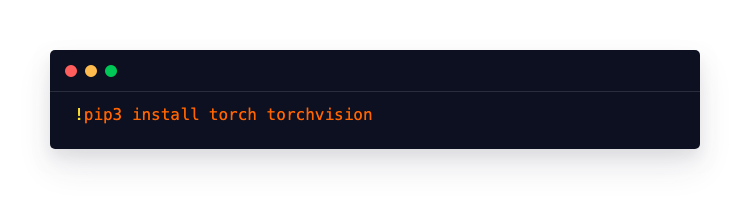
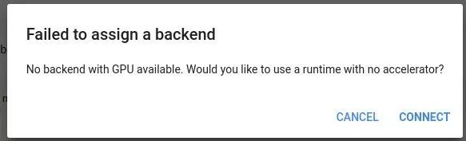

# 免费！Google Colab现已支持英伟达T4 GPU


### 

------

**【新智元导读】**Google Colab现在提供免费的T4 [GPU](https://cloud.tencent.com/product/gpu?from=20065&from_column=20065)。Colab是Google的一项免费云端机器学习服务，T4GPU耗能仅为70瓦，是面向现有数据中心基础设施而设计的，可加速AI训练和推理、机器学习、数据分析和[虚拟桌面](https://cloud.tencent.com/product/cvd?from=20065&from_column=20065)。

Google Colab是Google内部Jupyter Notebook的交互式Python环境，不需要在本地做多余配置，完全云端运行，存储在GoogleDrive中，可以多人共享，简直跟操作Google Sheets一样简单。之前只提供英伟达Tesla K80，现在已经支持TPU了！英伟达T4 GPU耗能仅为70瓦，是面向现有数据中心基础设施而设计的，可加速AI训练和推理、机器学习、数据分析和虚拟桌面。


运行命令

- 

```javascript
!nvidia-smi
```

复制

返回结果


有Reddit网友表示Colab TPU比本地GTX 1080Ti的速度**慢了将近2倍**。

Google关于使用TPU的教程：

https://colab.research.google.com/notebooks/tpu.ipynb#scrollTo=71iSWtsXe36x

**Google Colab介绍**

Google Colab不需要安装配置Python，并可以在Python 2和Python 3之间快速切换，支持Google全家桶：TensorFlow、BigQuery、GoogleDrive等，支持pip安装任意自定义库，支持apt-get安装依赖。


它最大的好处是为广大的AI开发者提供了免费的GPU和TPU，供大家进行机器学习的开发和研究。GPU的型号正是Tesla K80，可以在上面轻松地跑Keras、Tensorflow、Pytorch等框架；最近新增加的TPU是英伟达T4，可以在更广阔的天地大有作为了。

当然还有一个好处：不需要前期环境配置。相信很多人对前期环境配置过程中，遇到的各种奇奇怪怪问题深有体会：Anaconda套件该选择哪个版本？路径没设置好导致Jupyter Notebook调不出来等等。而Google Colab直接配置好一个环境，即插即用。


Colab的文档使用我们最喜爱的Markdown格式，并且提供预览模式可以直接看到输出文档的最终样式。

虽然说目前为止一直免费，一次最多可以免费使用12小时。但不确定是否未来会收费。所谓早体验早享受；晚体验有可能要等折扣了。

Colab官网：

https://colab.research.google.com

**预备工作**

首先我们需要在Google Drive上新建一个文件夹：


然后从下拉菜单里直接进入Colab即可。



接下来需要做一些简单的配置。比如你可以选择使用Python 2或者3笔记本，然后选择硬件加速器，接下来就可以愉快的敲代码了。

或者你也可以直接wget一个共享的zip包。例如下载并解压Udacity的花朵数据：


**创建/打开一个笔记本**

在Colab里创建/打开笔记本很简单，直接点击新建/打开即可：


创建的时候会提示你选择GPU或者TPU。如果你没有选，或者你想给现有的项目更换硬件加速器，那么都可以通过Edit→Notebook Settings，或者Runtime→Change rumtime type重新选择，即时生效。


更换硬件加速器类型后，运行以下[代码检查](https://cloud.tencent.com/product/tcap?from=20065&from_column=20065)是否使用了GPU或者TPU：

```javascript
from tensorflow.python.client 
import device_libdevice_lib.list_local_devices()
```

复制


如果返回结果中没有GPU或者TPU字样只有CPU字样，那么说明没有使用到二者。



注意上图里的Github标签，超棒对不对！


还有一点需要注意的是，因为Colab运行在云端，所以一定要记住**随时保存**，请把保存按钮当做vim里的esc来对待。


当然也可以把文件下载到本地或者上传到云端。

**库的安装和使用**

Colab自带Tensorflow、Matplotlib、Numpy、Pandas等深度学习基础库，直接import即可，目前连PyTorch也能直接import了。

某些库可能需要先安装后才能使用，比如keras：


安装PyTorch：



除了pip，还支持apt-get。安装OpenCV：


安装XGBoost：


有的第三方Python库可能需要依赖Java或是其他软件才能运行，安装过程稍微复杂一点：


注意**--yes**这个小操作很关键，如果没有系统可能会卡住（有兴趣的读者可以尝试一下）。其他软件也类似，注意最后加上**--yes**。

安装有版权的oracle-java-installer，需要有同意协议的操作：


设置系统默认jdk：


测试Java是否安装成功：


**2个小技巧**

**1. 免费用GPU**

在笔记本设置中，确保硬件加速选择了GPU。检查是否真的开启了 GPU（即当前连接到了GPU实例），可以直接在Jupyter Notebook中运行以下命令：

```javascript
import tensorflow as tf
device_name = tf.test.gpu_device_name()
if device_name != '/device:GPU:0':
 raise SystemError('GPU device not found')
print('Found GPU at: {}'.format(device_name))
```

复制

顺利的话会出现：

```javascript
Found GPU at: /device:GPU:0
```

复制

不顺利的话：



谷歌允许你一次最多持续使用12小时的免费 GPU。

**2. 上传并使用数据文件**

除了使用菜单里的上传按钮外，我们还可以通过代码调用笔记本中的文件选择器：

```javascript
from google.colab 
import filesuploaded = files.upload()
```

复制

之后，我们就会发现单元 cell 下出现了“选择文件”按钮：


然后就可以直接上传文件了

参考链接：

1. https://www.reddit.com/r/MachineLearning/comments/bglwhy/n_google_colab_now_comes_with_free_t4_gpus/
2. https://towardsdatascience.com/getting-started-with-google-colab-f2fff97f594c
3. https://www.jianshu.com/p/000d2a9d36a0
4. https://www.kdnuggets.com/2018/02/essential-google-colaboratory-tips-tricks.html