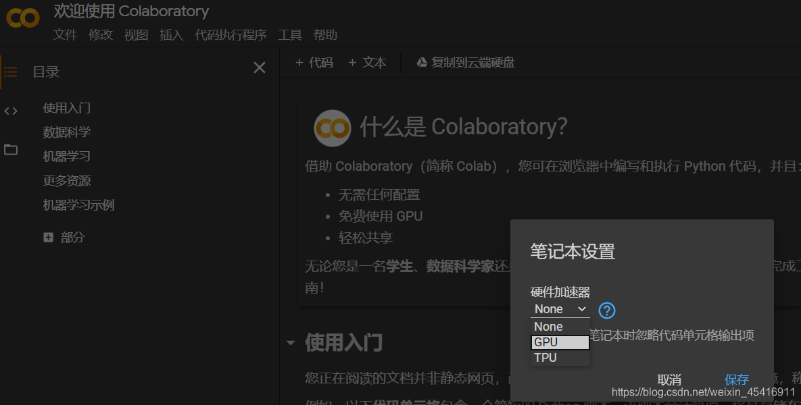
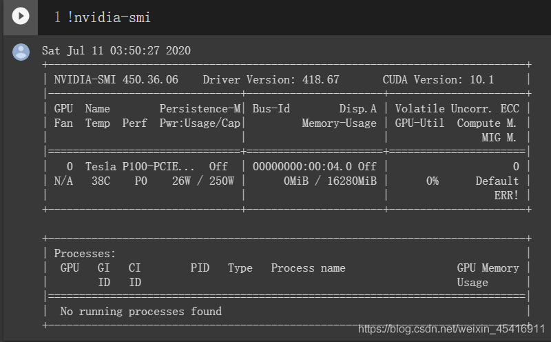
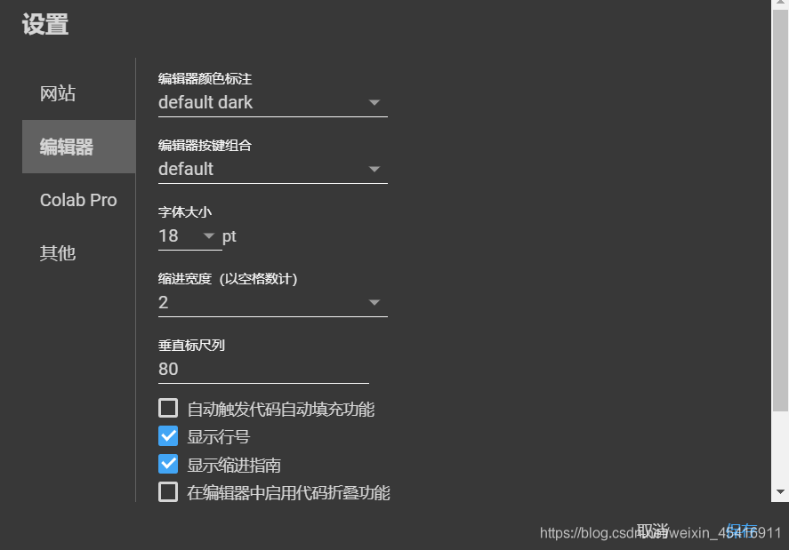
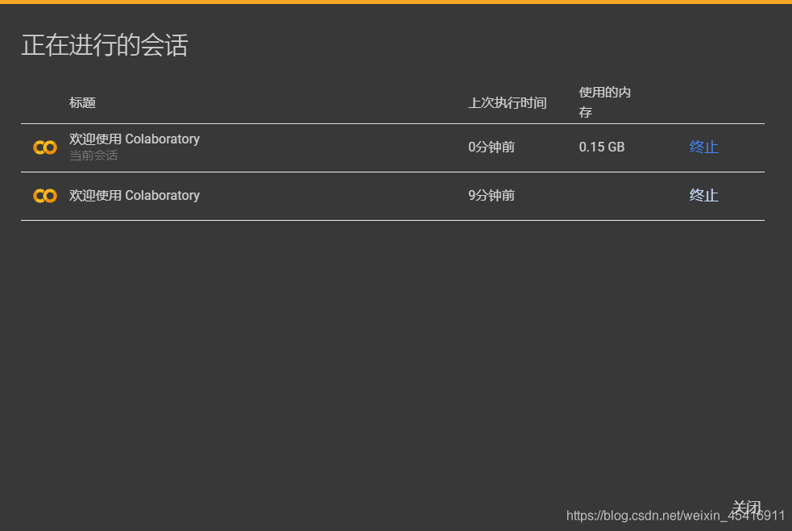
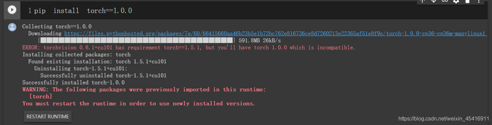
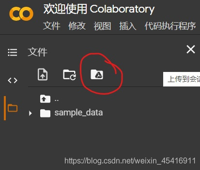
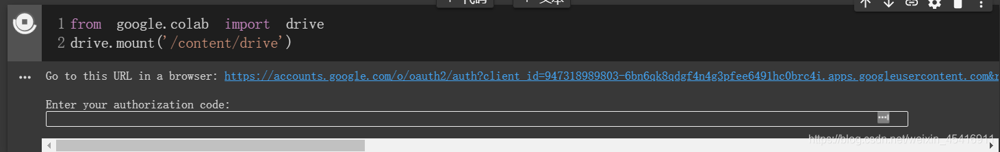
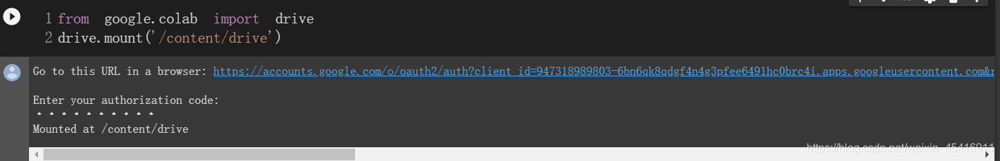
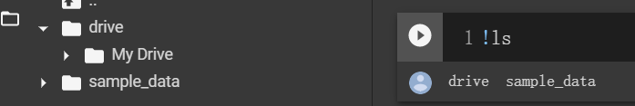
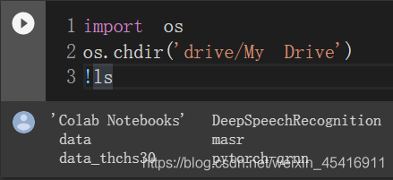

# 白嫖，深度学习利器Google Colab

  当下最火的领域莫过于人工智能了，不管是深度学习、数据分析都立足于庞大的数据，这就导致对计算机算力要求较高，即对电脑配置要求很高。但是，很多人的笔记本电脑只能跑一些demo，跑稍大一点的模型都提心吊胆。所以，向大家介绍Google Colab，只需要一个能上网的电脑和一个谷歌账号就能在Google提供的GPU上跑代码了，几乎不占用自己电脑的资源。

1. ## Google Colab简介

  > Google Colab是 Google Research 团队开发的一款产品。在 Colab 中，任何人都可以通过浏览器编写和执行任意Python 代码。它尤其适合机器学习、数据分析和教育目的。从技术上说，Colab 是一种托管式 Jupyter笔记本服务。无需进行设置，就可以直接使用，同时还能获得 GPU 等计算资源的免费使用权限。

重点信息：

免费分配GPU资源。进入Google Cloab页面，默认是没有GPU加速的，需要自己设置，在左上角代码执行程序->更改运行时类型选项，会弹出笔记本设置：



选择GPU就好了，系统会自动分配GPU。比如，这里就给我分配了16G的Tesla P100显卡（大约3万RMB），很良心了。




注意，点击保存之后可能会重启服务，会清空已经跑的代码或者配置，所以如果要用GPU，最好一开始就选。

2. jupyter内核，所以Colab笔记本用法几乎和jupyter notebook一样。初始界面类似于这样：


可以点击右上角的设置图标设置编辑器：



可以在代码执行程序里面管理正在运行的笔记本。



3. 编写和执行任意python代码。Colab已经搭建好了python3.6.9环境，并且内置tensorflow2.2和pytorch1.5框架直接使用，包括numpy等一些基础的包都有。支持直接在单元格里执行pip install 包名来安装需要的包。更换tensorflow或者torch的版本的话，直接在单元格里执行pip命令就ok了。然后点击RESTART RUNTIME即可更换版本（一些依赖包也要更换）。有时候可能需要先卸载原来的包，再安装，才能更换成功。不用担心，下载很快，实测500+M的torch1.0不用1分钟就下好了。



学会以上的基本操作就可以愉快的使用Colab。
缺点：Google Colab最多只能连续在线12小时，超过12小时就会断开，并且所有东西会被清空。下次需要重新配置。而且Colab稳定性肯定没有本地机子好。能白嫖已经不错了，我认为不是缺点。
2. ## 提高

  1. Google Colab和Google硬盘可以无缝对接。从Colab可以访问硬盘里任何内容。也可以存储笔记本到硬盘里，下次打开即可运行，需要的只是一个Google账号而已，硬盘有免费的15G空间。只需点击左边第3个文件夹一样的图标，然后点击画圈的：

     

会让你运行以下代码，点击运行单元格，然后会给一个链接（图中蓝字）：



点击链接，用你的谷歌账号登陆，会给你一串密码：


复制粘贴，按回车出现以下结果即表示连接上谷歌硬盘：



可以访问硬盘里的东西了。
Colab是运行在虚拟机上的，所以多数Linux命令都可以使用。只需要在前面加上感叹号即可。比如打印当前文件夹下的目录用!ls命令。可以看到默认所在位置。My Drive文件夹就是谷歌硬盘。



可以通过
```
import os
os.chdir('drive/My Drive')
!ls
```
来进入硬盘目录。好像不能用!cd操作来更改目录（也许是我方法不对），所以使用os.chdir()来代替cd更改目录。



以上，差不多就可以愉快的使用Colab跑代码了。因为退出Colab，所有东西会被清空，所以建议建一个笔记本保存到硬盘里，把常用的配置写进去，下次直接运行这个笔记本（默认存在Colab Notebooks文件夹里）。
  最后，总结下流程，先在本地把代码调试好（在硬盘里改很麻烦），然后上传到谷歌硬盘，将数据上传到谷歌硬盘（如果数据很大推荐在本地读取好上传，我上传7G的thchs30数据集用了一晚上，还出现了问题），然后进入要运行的python文件目录，单元格里输入!python test.py再运行该单元格即可。
  当然，Colab的功能远不止于此，还可以与GitHub交互，还有很多功能待发掘。

————————————————

版权声明：本文为CSDN博主「既往不恋未来不迎」的原创文章，遵循CC 4.0 BY-SA版权协议，转载请附上原文出处链接及本声明。

原文链接：https://blog.csdn.net/weixin_45416911/article/details/107281053